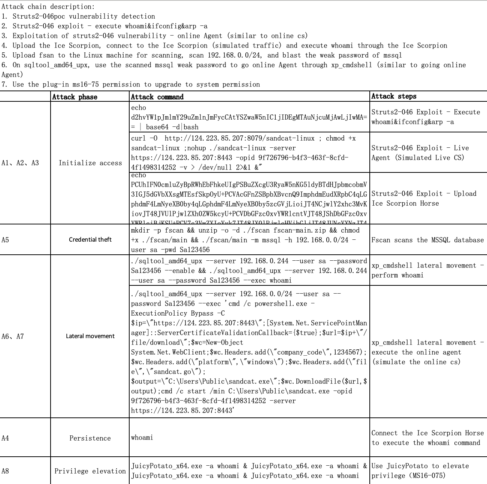
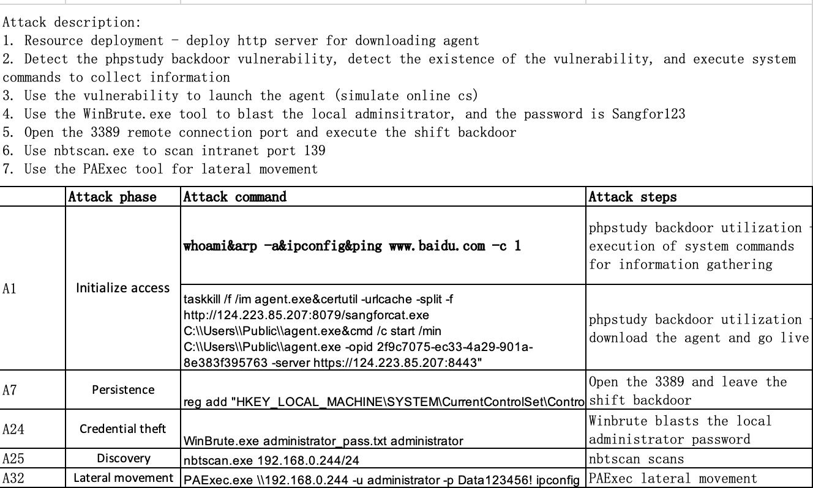
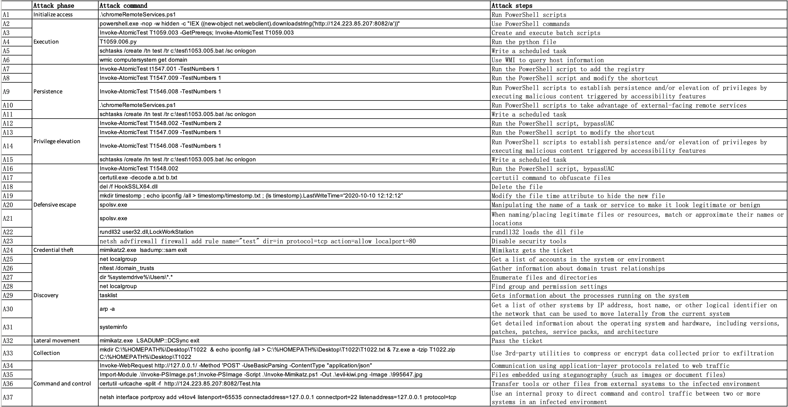
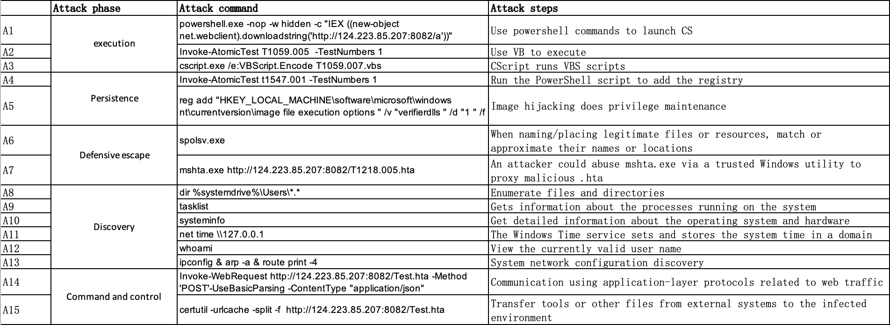
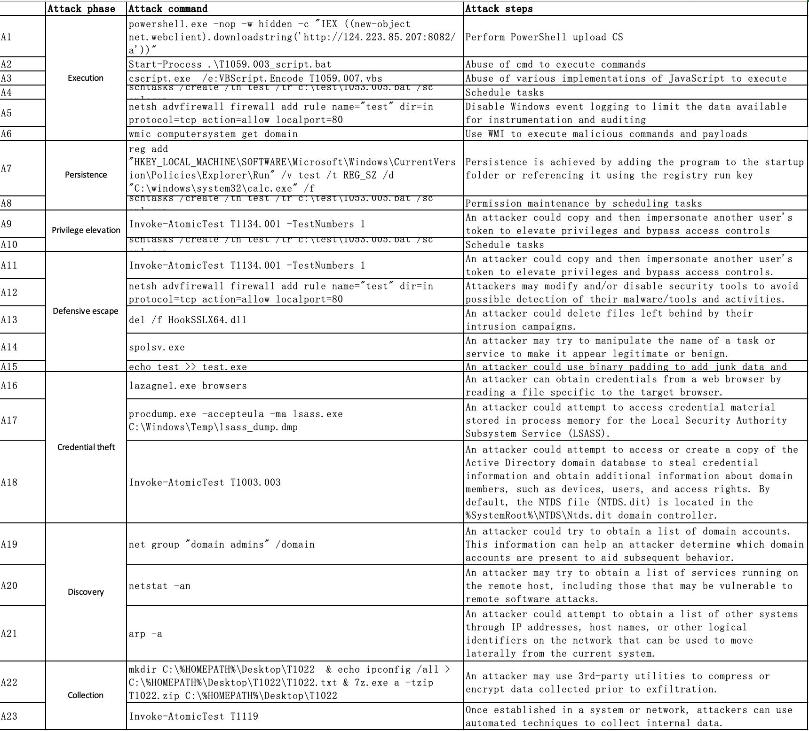

# Simulated-Data
We carried out 5 attacks on three different hosts. The attack description and annotation are listed in the _doc_ folder.

### Simulate on Ubuntu
We carried out an attack on Ubuntu 20.04.

SimulatedUbuntu.zip  
$\qquad$- hw17.zip  
$\qquad\qquad$- benign.json  
$\qquad\qquad$- anomaly.json  

### Simulate on Windows server 2012
We carried out an attack on Windows server 2012.

SimulatedWS12.zip  
$\qquad$- hw20.zip  
$\qquad\qquad$- benign.json  
$\qquad\qquad$- anomaly.json  

### Simulate on Windows 10
We carried out three attacks on Windows 10.

#### APT29

#### Sidewinder

#### FIN6

SimulatedW10.zip  
$\qquad$- win10.zip  
$\qquad\qquad$- benign.json  
$\qquad\qquad$- anomaly.json 